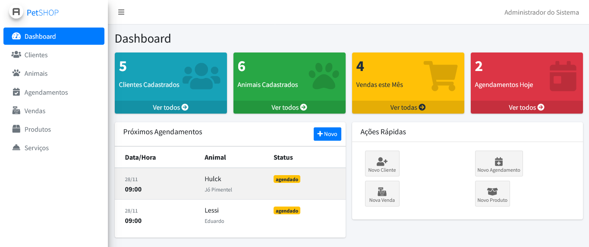

# PetShop Manager 🐾




## Sobre o Projeto

O **PetShop Manager** é uma aplicação web desenvolvida para automatizar e otimizar a operação de estabelecimentos pet. O sistema oferece controle completo sobre clientes, animais, agendamentos, vendas e estoque, atendendo às necessidades de pequenos e médios negócios do segmento.

🎥 **Videocast da Aplicação**: [Assista à demonstração completa no YouTube](https://www.youtube.com/watch?v=uQg8sNcO33o)

## Tecnologias Utilizadas

- **Backend:** Laravel 12 (PHP)
- **Banco de Dados:** MySQL
- **Frontend:** Blade Templates + AdminLTE 3
- **ORM:** Eloquent
- **Ferramentas:** Composer, Artisan CLI

## Estrutura do Banco de Dados

O sistema possui **14 entidades principais** com relacionamentos bem definidos:

### Entidades Principais
- **Gestão de Pessoas:** Clientes, Animais, Funcionários, Cargos
- **Operacionais:** Agendamentos, Serviços, Vendas
- **Produtos:** Produtos, Categorias, Fornecedores
- **Suporte:** Raças

### Relacionamentos Implementados
- Cliente 1:N Animal
- Animal N:1 Raça
- Agendamento N:N Serviço (via tabela pivot)
- Venda N:N Produto (via tabela pivot)

## Funcionalidades

### Módulos Principais
- **Dashboard** com métricas em tempo real
- **CRUD Completo** para todas as entidades
- **Sistema de Agendamentos** integrado com serviços
- **Controle de Vendas** com cálculo automático
- **Gestão de Estoque** com alertas de reposição
- **Autenticação** segura com controle de acesso

### Features Técnicas
- Migrations para versionamento do banco
- Seeders para dados iniciais
- Relacionamentos ORM com Eloquent
- Interface responsiva com AdminLTE
- Validações de formulários
- Soft Deletes onde aplicável

## Arquitetura

O projeto segue o padrão **MVC (Model-View-Controller)**:

- **Models:** Representam as tabelas e relacionamentos
- **Controllers:** Gerenciam a lógica de negócio
- **Views:** Interface Blade com AdminLTE
- **Migrations:** Estrutura versionada do banco

## Modelagem Destacada

### Agendamentos
Sistema completo de agendamento com:
- Vinculação a animais e clientes
- Múltiplos serviços por agendamento
- Controle de status (agendado, confirmado, realizado)
- Integração com funcionários

### Vendas
Módulo de vendas com:
- Itens de venda via tabela pivot
- Cálculo automático de totais
- Baixa automática no estoque
- Histórico completo

## 🚀 Como Executar

```bash
# Clone o repositório
git clone [url-do-repositorio]

# Instale as dependências
composer install

# Configure o .env
cp .env.example .env

# Execute as migrations e seeders
php artisan migrate --seed

# Inicie o servidor
php artisan serve
```


*Projeto desenvolvido para a disciplina de Programação em Banco de Dados - UNIFACEMA 2025*
